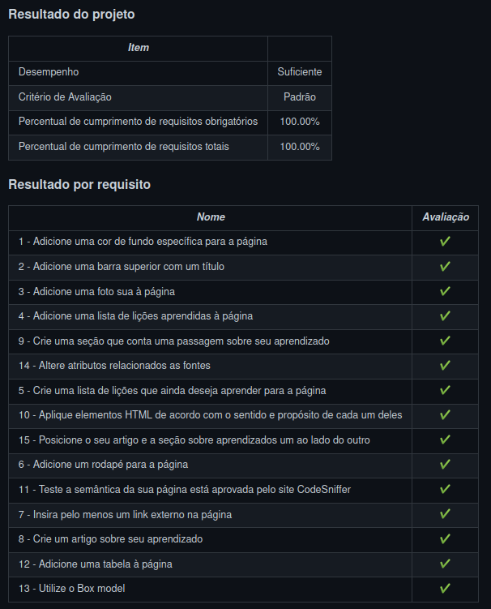

# Trybe

> Este repositório contêm todas as atividades de aprendizagem que estão sendo desenvolvidas por  _[Flávio Bianchetti](https://www.linkedin.com/in/flaviobianchetti/)_ enquanto estuda na _[Trybe](https://www.betrybe.com/)_ :rocket: (2021-2022).

## Introdução ao HTML & CSS

### Bloco 3.5: [Projeto - Lessons Learned] :heavy_check_mark:

### Partes de 1 a 15

**Descrições:** entender como funciona a estrutura (HTML) de uma página, entender como o estilo (CSS) é aplicado à página, construir páginas utilizando HTML e CSS, realizar manutenções em páginas já existentes e aplicar Layout e Box Model na pŕatica.

## Nota no Projeto Lessons Learned

Confira o resultado deste e de outros projetos no <a href="https://flavio-bianchetti.github.io/" target="_blank">portifólio</a>.

# English version - Trybe

> This repository contains all the learning activities being developed by _[Flávio Bianchetti](https://www.linkedin.com/in/flaviobianchetti/)_ while studying at _[Trybe](https://www.betrybe.com/)_ :rocket: (2021-2022).

## Introduction to HTML & CSS

### Block 3.5: [Project - Lessons Learned] :heavy_check_mark:

### Parts 1 to 15

**Descriptions:** understand how the structure (HTML) of a page works, understand how the style (CSS) is applied to the page, build pages using HTML and CSS, perform maintenance on existing pages and apply Layout and Box Model in the practice.

## Grade on Lessons Learned Project

_Picture above_

Check out the results of this and other projects in the <a href="https://flavio-bianchetti.github.io/" target="_blank">portfolio</a>.