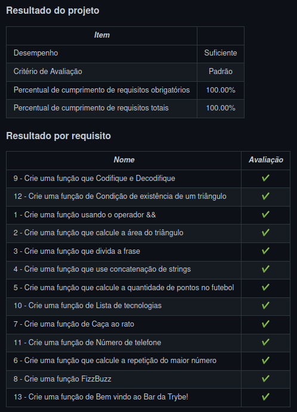

# Trybe

> Este repositório contêm todas as atividades de aprendizagem que estão sendo desenvolvidas por  _[Flávio Bianchetti](https://www.linkedin.com/in/flaviobianchetti/)_ enquanto estuda na _[Trybe](https://www.betrybe.com/)_ :rocket: (2021-2022).

## Introdução à JavaScript e Lógica de Programação

### Bloco 4.5: [Projeto - Playground Functions] :heavy_check_mark:

### Partes de 1 a 13

**Descrições:**  o projeto consiste em quebrar grandes problemas em problemas menores e utilizar a lógica de programação na resolução.

## Nota no Projeto Playground Functions

Confira o resultado deste e de outros projetos no <a target="_blank" href="https://flavio-bianchetti.github.io/">portifólio</a>.

# English version - Trybe

> This repository contains all the learning activities being developed by _[Flávio Bianchetti](https://www.linkedin.com/in/flaviobianchetti/)_ while studying at _[Trybe](https://www.betrybe.com/)_ :rocket: (2021-2022).

## Introduction to JavaScript and Programming Logic

### Block 4.5: [Project - Playground Functions] :heavy_check_mark:

### Parts 1 to 13

**Descriptions:** the project consists of breaking big problems into smaller problems and using programming logic in the solution.

## Score on Playground Functions Project

_Picture above_

Check out the results of this and other projects in the <a target="_blank" href="https://flavio-bianchetti.github.io/">portfolio</a>.